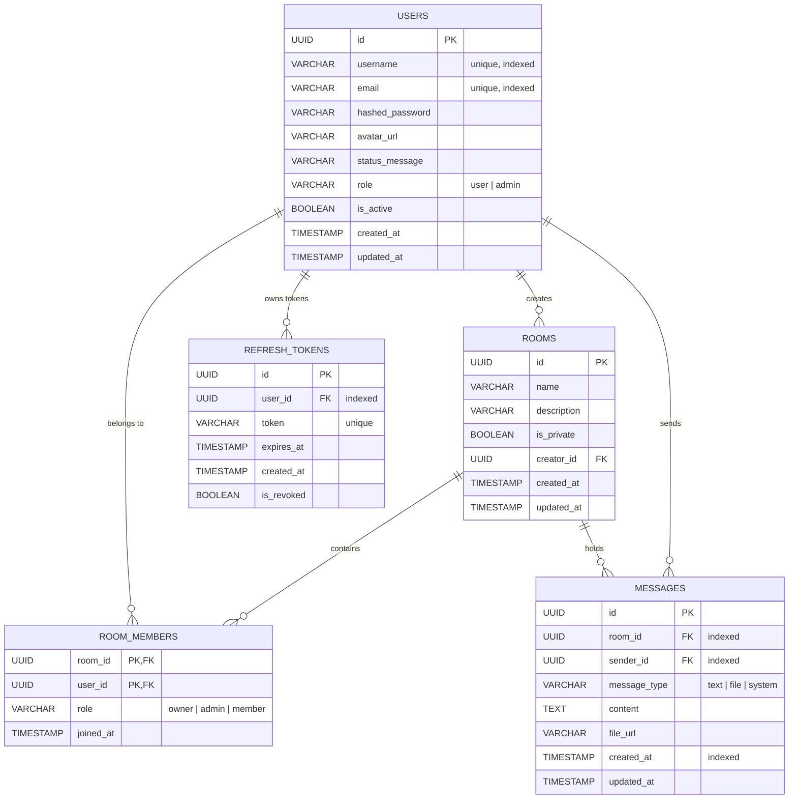

# Database Design & Model Specifications
## Chat World v2

This document details the relational database configurations, SQLAlchemy 2.x mapping styles, and local vs production databases setup.

---

### 1. Database Flexibility Setup
To ensure rapid local development and production reliability:
*   **Production Database:** PostgreSQL 16+ (Dockerized or Managed Service).
*   **Development Database:** SQLite (Stored locally as a file: `sqlite:///./chatworld.db`).

#### 1.1 SQLite-specific Configurations
SQLite does not natively support features like foreign key constraints by default. During connection initialization, SQLAlchemy listener hooks will enforce foreign keys:
```python
from sqlalchemy.engine import Engine
from sqlalchemy import event

@event.listens_for(Engine, "connect")
def set_sqlite_pragma(dbapi_connection, connection_record):
    if "sqlite" in str(connection_record):
        cursor = dbapi_connection.cursor()
        cursor.execute("PRAGMA foreign_keys=ON")
        cursor.close()
```

---

### 2. Entity Relationship Diagram (Mermaid)



---

### 3. SQLAlchemy 2.x Modeling Standards

All backend models must utilize SQLAlchemy 2.x Declarative Base using type annotations (`Mapped` and `mapped_column`).

#### 3.1 Example Model Definition: `User`
```python
from datetime import datetime
from uuid import UUID, uuid4
from sqlalchemy.orm import DeclarativeBase, Mapped, mapped_column, relationship
from sqlalchemy import String, DateTime, Boolean

class Base(DeclarativeBase):
    pass

class User(Base):
    __tablename__ = "users"

    id: Mapped[UUID] = mapped_column(primary_key=True, default=uuid4)
    username: Mapped[str] = mapped_column(String(50), unique=True, index=True, nullable=False)
    email: Mapped[str] = mapped_column(String(255), unique=True, index=True, nullable=False)
    hashed_password: Mapped[str] = mapped_column(String(255), nullable=False)
    avatar_url: Mapped[str | None] = mapped_column(String(2048), nullable=True)
    status_message: Mapped[str | None] = mapped_column(String(150), nullable=True)
    role: Mapped[str] = mapped_column(String(20), default="user", nullable=False) # user | admin
    is_active: Mapped[bool] = mapped_column(Boolean, default=True, nullable=False)
    
    created_at: Mapped[datetime] = mapped_column(DateTime, default=datetime.utcnow, nullable=False)
    updated_at: Mapped[datetime] = mapped_column(DateTime, default=datetime.utcnow, onupdate=datetime.utcnow, nullable=False)

    # Relationships
    refresh_tokens: Mapped[list["RefreshToken"]] = relationship(back_populates="user", cascade="all, delete-orphan")
```

---

### 4. Alembic Migration Guidelines
*   All schema changes must run through Alembic migration scripts located in `database/migrations`.
*   Alembic auto-generator will load the standard metadata from `backend/app/core/database.py` referencing the base models metadata.
*   Locally, SQLite migrations can run safely using `alembic upgrade head`. In production environments, running migrations is containerized as an entrypoint step before launching the server.
