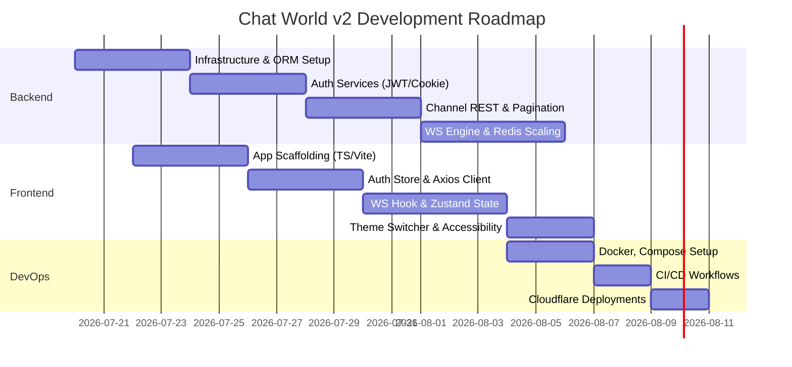

# Development Roadmap
## Chat World v2

---

### 1. Phased Timelines

---

### 2. Implementation Checklist (Easiest to Hardest)

This ordered checklist guides the development flow from initial configuration up to deployment verification.

#### Phase A: Foundations & Setup (Est: 3 Days)
*   [ ] **Task 1: Environment Variables & Backend Setup (EASY)**
    *   Create `backend/app/core/config.py` loading configurations via Pydantic-settings.
    *   Create dependency `requirements.txt` list.
*   [ ] **Task 2: Setup Database Engine & Models (EASY)**
    *   Setup SQLAlchemy declarative base in `backend/app/infrastructure/database/models.py`.
    *   Support Postgres/SQLite switching based on configurations.
    *   Initialize Alembic migrations directory.
*   [ ] **Task 3: Scaffold Frontend Workspace (EASY)**
    *   Initialize React 19 workspace with Vite, TypeScript, and Tailwind CSS.
    *   Configure basic folders and routes mapping via React Router.

#### Phase B: User Domain & Auth Operations (Est: 5 Days)
*   [ ] **Task 4: Password Hashing & Security Utilities (EASY)**
    *   Build bcrypt hash validation helpers.
*   [ ] **Task 5: Auth Use Cases & Endpoint Routing (MEDIUM)**
    *   Develop signup and login business use cases.
    *   Setup access token signed payloads and cookie refresh token logic in `/auth/login` and `/auth/refresh`.
*   [ ] **Task 6: Frontend Auth State (MEDIUM)**
    *   Write Zustand `authStore.ts` tracking user state and access tokens.
    *   Write Axios client instances attaching authorization headers and silent cookie refreshes.

#### Phase C: Chat REST Services (Est: 5 Days)
*   [ ] **Task 7: CRUD for Channels/Rooms (MEDIUM)**
    *   Develop use cases to list, create, and search chat rooms.
    *   Implement user memberships constraints (join/leave).
*   [ ] **Task 8: Paginated Chat Logs (MEDIUM)**
    *   Implement paginated query endpoints in FastAPI (using database cursor keys).
    *   Integrate TanStack Query on frontend to scroll load historical logs.

#### Phase D: Real-Time Sockets & Redis Pub/Sub (Est: 6 Days)
*   [ ] **Task 9: WebSocket Connection Manager (MEDIUM)**
    *   Create base WS route upgraded handler.
    *   Manage connections list in local server memory.
*   [ ] **Task 10: Redis Pub/Sub Integrations (HARD)**
    *   Integrate Redis client to broadcast WS events across multiple application nodes.
*   [ ] **Task 11: Real-time UI Client Hooks (HARD)**
    *   Implement custom WebSocket hook in React with status notifications, keep-alive checks, and auto reconnect.

#### Phase E: DevOps & Production Setup (Est: 4 Days)
*   [ ] **Task 12: Docker Configuration (MEDIUM)**
    *   Configure production Dockerfiles for React (static server) and FastAPI backend.
    *   Configure `docker-compose.yml` linking Redis, Postgres, and the app.
*   [ ] **Task 13: Github Actions Workflows (MEDIUM)**
    *   Automate testing on pushes.
*   [ ] **Task 14: Cloudflare Setup (HARD)**
    *   Deploy static assets to Cloudflare pages, configuring reverse proxy routing to the backend.
