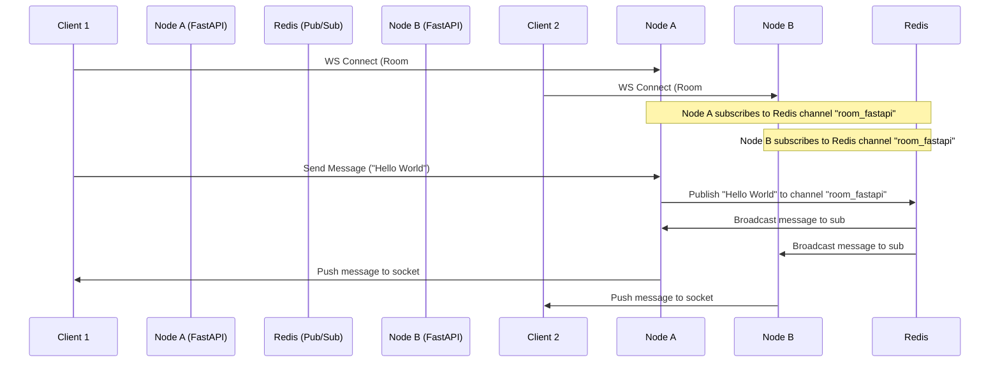

# System Architecture Design
## Chat World v2

This document defines the high-level system architecture, Clean Architecture layers, Domain-Driven Design (DDD) components, and infrastructure integration details for Chat World v2.

---

### 1. Architectural Blueprint (Clean Architecture + DDD)

Chat World v2 is built on **Clean Architecture** principles to isolate the core business logic from framework and infrastructure dependencies.

```mermaid
graph TD
    subgraph Use Cases & Domain (Core)
        Domain[Domain Layer: Entities, Value Objects, Domain Events]
        UseCases[Application Layer: Use Cases, Input/Output Ports, DTOs]
    end

    subgraph Adapters & Controllers (Interface)
        Controllers[Interface Adapters: FastAPI Controllers, WS Handlers, Presenters]
    end

    subgraph External Agencies (Infrastructure)
        DB[(PostgreSQL / SQLite Database)]
        Cache[(Redis Cache & Pub/Sub)]
        
        Storage[S3 Media Storage]
    end

    %% Dependencies point inward
    Controllers --> UseCases
    UseCases --> Domain

    %% Infrastructure adapts to Interfaces
    DB -.-> Controllers
    Cache -.-> Controllers
    Storage -.-> Controllers
    Cloudflare -.-> Controllers
```

#### Layer Definitions:
1.  **Domain Layer (Core/Domain):** Encompasses business models (e.g., `User`, `Room`, `Message` objects) and domain-specific rules. It depends on absolutely no libraries or frameworks (pure Python classes).
2.  **Application Layer (Core/Application):** Implements business use cases (e.g., `CreateRoomUseCase`, `SendMessageUseCase`). It defines ports (interfaces) for external services like database repositories or pub/sub broadcasters.
3.  **Interface Adapters (Infrastructure/Adapters):** Translates data between Use Cases and external technologies. Includes FastAPI routers, request request-response validators (Pydantic), and database Repository implementations.
4.  **Infrastructure (Infrastructure/External):** Consists of frameworks, engines, databases (PostgreSQL/SQLite), cache brokers (Redis), and deployment services.

---

### 2. Scalable WebSocket Architecture (Redis Pub/Sub)

To support multiple application nodes (scaling behind a load balancer), WebSocket subscriptions are coordinated via **Redis Pub/Sub**.



---

### 3. Application Security & Access Control

*   **API Versioning:** All endpoints are versioned with the prefix `/api/v1` (e.g., `/api/v1/auth/login`).
*   **Role-Based Access Control (RBAC):** Every user is assigned a role (e.g., `User`, `Admin`). Access to administrative endpoints (such as deleting rooms, suspending users) is protected via security dependencies:
    ```python
    async def get_current_admin_user(current_user: User = Depends(get_current_active_user)):
        if current_user.role != UserRole.ADMIN:
            raise HTTPException(status_code=403, detail="Not enough privileges")
        return current_user
    ```
*   **Token Lifecycle:** Access Token is a short-lived, signed JWT (expires in 15 minutes). Refresh Token is a random cryptographically secure UUID stored in the database with an expiration date and dropped into a secure, `HttpOnly`, `Secure`, `SameSite=Strict` cookie.

---

### 4. Logging & Central Exception Handling

#### 4.1 Central Exception Handling
FastAPI custom exception handlers map specific exceptions (Domain, Infrastructure, Validation) into clean JSON responses. This isolates internal error stacktraces from client responses.

```python
@app.exception_handler(DomainException)
async def domain_exception_handler(request: Request, exc: DomainException):
    logger.warning(f"Domain rule violation: {exc.message}")
    return JSONResponse(
        status_code=400,
        content={"error_code": exc.error_code, "detail": exc.message}
    )
```

#### 4.2 Logging Strategy
*   Structured logging using Python's standard `logging` library or `loguru`.
*   Levels:
    *   `INFO` for incoming HTTP request/response metrics and connection lifecycles.
    *   `WARNING` for bad authentication requests or authorization failures.
    *   `ERROR` for database or internal connection timeouts, sending traces to log monitoring.
*   Production log outputs are structured as JSON (easy ingestion by OpenTelemetry or Cloudwatch).

---

### 5. Deployment Architecture (Render + Docker)

*   **Render Web Service:** Serves static frontend client build (index.html/JS/CSS assets) under `/` and `/assets/*`, and handles WebSocket/REST API requests under `/api/v1/*` on a single URL domain.
*   **Docker Compose Configuration:**
    *   `web` service (FastAPI application serving frontend and backend concurrently).
    *   `db` service (PostgreSQL database instance).
    *   `redis` service (Redis session pub/sub coordination).
