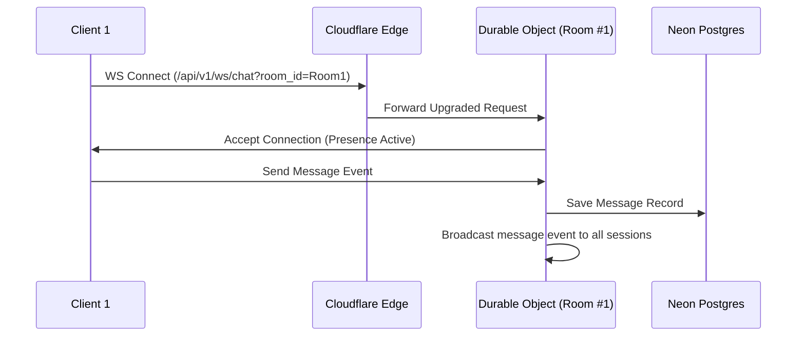

# System Architecture Design
## Chat World v2 (Cloudflare-Native)

This document defines the high-level serverless system architecture, Clean Architecture layers, and infrastructure integration details for Chat World v2.

---

### 1. Architectural Blueprint (Clean Architecture + Serverless)

Chat World v2 uses a serverless interface adaptation model:

```mermaid
graph TD
    subgraph Use Cases & Domain (Core)
        Domain[Domain Layer: Entities, Value Objects]
        UseCases[Application Layer: Use Cases, Interfaces]
    end

    subgraph Adapters & Controllers (Hono Router)
        Controllers[Interface Adapters: Hono Controllers, DO WS Handlers]
    end

    subgraph External Agencies (Infrastructure)
        DB[(Neon PostgreSQL Database)]
        R2[(Cloudflare R2 Bucket)]
        DO[(Durable Objects Room State)]
    end

    %% Dependencies point inward
    Controllers --> UseCases
    UseCases --> Domain

    %% Infrastructure adapts to Interfaces
    DB -.-> Controllers
    R2 -.-> Controllers
    DO -.-> Controllers
```

---

### 2. Durable Objects Real-time WebSocket Routing
All active room connections run inside a dedicated **Durable Object** instance (`ChatRoom`). In-memory presence lists, typing indicators, and message broadcasts are executed directly at the edge, eliminating the need for external Redis caches:



---

### 3. Application Security & Access Control
*   **Web Crypto Password Hashing:** Uses native PBKDF2 Web Crypto API with 100,000 iterations to verify passwords natively inside the V8 engine without heavy node-native bindings.
*   **Dual Tokens Lifecycle:** JWT Access tokens expire in 15 minutes. Refresh tokens are random UUID values saved in Neon Postgres and dropped in Secure, HttpOnly, SameSite=Strict cookies.
